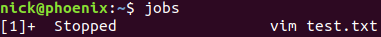
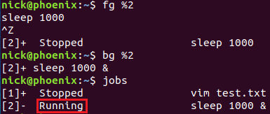

# (转)基础1 linux进程组(job)
Linux 系统中有一个 job control 的概念，本文简单介绍什么是 job，以及常见的 job control 命令。本文中演示部分使用的环境为 ubuntu 18.04。

# 进程组(job)
执行一个命令会创建一个或多个进程，这些进程被称为一个进程组(process group)。进程组中包含一个或多个进程，每个进程都会属于一个进程组，进程组也叫 job。

每个进程组都有一个领头进程(process group leader)，领头进程的 PID 就是进程组的 ID(process group ID，PGID)，我们可以通过 ps 命令查看进程的 PGID：

```Plain Text
$ ps -o pid,ppid,pgid,comm | cat
```


红框中的两个进程属于同一进程组(通过管道符连接的进程属于相同的进程组)。这个进程组中的领头进程为 16823，因此它的 PID 成了进程组的 PGID。我们可以通过下图来理解这几个进程之间的关系：


领头进程可以先退出，这时进程组依然存在并且 PGID 也不会发生变化。在进程组中的所有进程都退出后，进程组的证明周期结束。
将进程划分到进程组中的主要原因是可以对它们进行统一的管理，说白了就是同时发信号给组内的所有进程，这就是我们接下来要介绍的 job 管理。

# Job 管理
有了前面 job 的概念(进程组)，接下来我们介绍如何管理 job。
**jobs 命令**
使用 vim 打开文件 test.txt，然后按下 ctrl + z，此时 vim 进入了后台：


输出的第一列方括号中的数字表示 jobID，第二列 Stopped 表示 job 当前的状态，第三列则表示该 job 执行的命令。
使用 jobs 命令可以查看当前会话中的的所有 jobs，此时执行 jobs 命令，输出的结果和上面一样：



**& 符**
在命令的后面加上 & 符号，可以直接让 job 运行在后台：

```Plain Text
$ sleep 1000 &
```


sleep 命令的 jobID 为 2，状态为 Running。

**fg 命令**
fg 命令是 foreground 的缩写。命令格式为 fg %n，它把当前或指定 ID 的 job 放到前台。下面我们操作一次 job 2：

```Plain Text
$ fg %2
```


此时 sleep 命令运行在前台，通过 ctrl + z 我们可以再次把它送回后台：


请注意此时 sleep 命令的状态已经变成了 Stopped。

**ctrl + z**
严格来说 ctrl + z 并不是一个 job 管理命令，它只是向当前进程发送一个 SIGSTOP 信号，该信号使进程进入暂停(stopped)状态，也就是挂起进程，此状态下，进程状态会被系统保存，此进程会被放置到作业队列中去，从而让出终端。使用 ctrl + z 我们可以暂停正在占用终端的进程而不结束它，然后我们可以使用终端命令来操作此进程。

**bg 命令**
bg 命令是 background 的缩写，命令格式为 bg %n，bg 命令和 ctrl + z 配合可以把前台命令切换到后台去执行。比如刚才我们通过 ctrl + z 把 sleep 命令切到了后台，但变成了 Stopped 状态，此时执行 bg %2 命令可以让 sleep 命令继续在后台执行：



**kill 命令**
kill 命令负责向进程发送信号，当然它也可以向 job 发送信号，在 jobID 前面添加 % 就可以了。比如 SIGCONT 是唤醒一个挂起的进程，所以我们也可以使用下面的命令把处于 Stooped 状态的 sleep 命令唤醒：


# 杀死进程
有时候使用 ctrl + c 无法杀死一个正在运行的前台进程，这是因为 ctrl + c 的本质是向进程发送 SIGINT 信号。SIGINT 是用来终止进程的，但是这是一个可以被忽略的信号，如果程序忽略了它，我们就无法通过 ctrl + c 来终止该进程。

此时我们可以先使用 ctrl + z 把进程切换到后台，然后使用 kill %n(n 为进程的 jobID)来终止进程。kill 命令默认向进程发送 SIGTERM 信号，程序一般会在 SIGTERM 信号的处理函数中正常地终止程序并执行资源清理工作。既然 SIGTERM 信号能够被程序处理，那么它也能够被忽略，所以也无法通过这种方式结束那些顽固的进程。

杀死进程的终极手段是 kill -SIGKILL PID(kill -9 PID)。SIGKILL 信号是不能被忽略的，所以这一招肯定管用。但是由于它过于强硬，使用这种方式杀死进程后往往会有后遗症，比如进程使用的资源没有在退出前清理干净，常见的例子是用这种方法杀死 vim 进程后会遗留下 .swp 文件。

# 暂停 tail 命令的输出
我们一般会使用 tail -f 命令查看实时的日志，但很多程序产生日志的速度非常快以至于我们跟不上节奏。此时使用
**ctrl + s** 命令可以暂停日志输出到终端，这样我们就可以仔细的分析当前终端中显示的日志。如果要接着输出日志，可以使用 **ctrl + q** 命令恢复日志的输出。
这两个命令的原理是：
ctrl + s 会告诉终端暂停，阻塞所有读写操作，即不转发任何数据，只有按了 ctrl + q 后，才会继续。这个功能应该是历史遗留的产物，以前终端和服务器之间没有流量控制功能，所以有可能服务器发送数据过快，导致终端处理不过来，于是需要这样一个命令告诉服务器不要再发了，等终端处理完了后再通知服务器继续。

**参考：**
[Job Control](https://www.gnu.org/savannah-checkouts/gnu/libc/manual/html_node/Job-Control.html)


---
原文：[https://www.cnblogs.com/sparkdev/p/11980732.html](https://www.cnblogs.com/sparkdev/p/11980732.html)