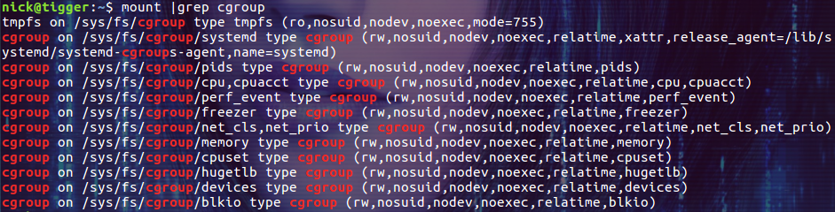
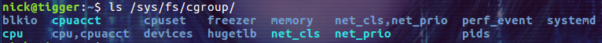
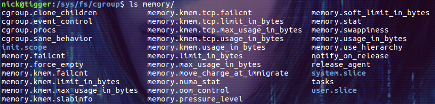
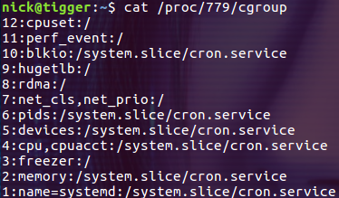
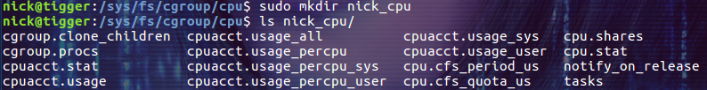
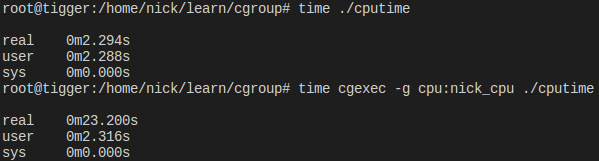
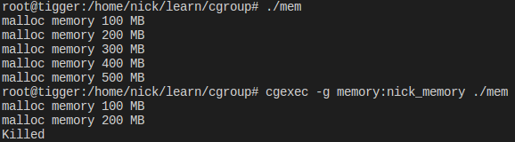
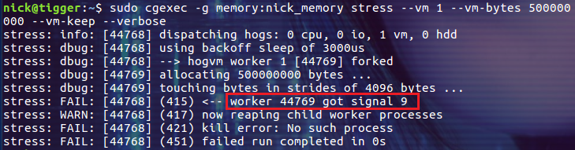

# (转)容器和权限1：linux cgroups 简介
cgroups(Control Groups) 是 linux 内核提供的一种机制，**这种机制可以根据需求把一系列系统任务及其子任务整合(或分隔)到按资源划分等级的不同组内，从而为系统资源管理提供一个统一的框架**。简单说，cgroups 可以限制、记录任务组所使用的物理资源。本质上来说，cgroups 是内核附加在程序上的一系列钩子(hook)，通过程序运行时对资源的调度触发相应的钩子以达到资源追踪和限制的目的。

本文以 Ubuntu 16.04 系统为例介绍 cgroups，所有的 demo 均在该系统中演示。

# 为什么要了解 cgroups
在以容器技术为代表的虚拟化技术大行其道的时代了解 cgroups 技术是非常必要的！比如我们可以很方便的限制某个容器可以使用的 CPU、内存等资源，这究竟是如何实现的呢？通过了解 cgroups 技术，我们可以窥探到 linux 系统中整个资源限制系统的脉络。从而帮助我们更好的理解和使用 linux 系统。

# cgroups 的主要作用
实现 cgroups 的主要目的是为不同用户层面的资源管理提供一个统一化的接口。从单个任务的资源控制到操作系统层面的虚拟化，cgroups 提供了四大功能：

* 资源限制：cgroups 可以对任务是要的资源总额进行限制。比如设定任务运行时使用的内存上限，一旦超出就发 OOM。
* 优先级分配：通过分配的 CPU 时间片数量和磁盘 IO 带宽，实际上就等同于控制了任务运行的优先级。
* 资源统计：cgoups 可以统计系统的资源使用量，比如 CPU 使用时长、内存用量等。这个功能非常适合当前云端产品按使用量计费的方式。
* 任务控制：cgroups 可以对任务执行挂起、恢复等操作。

# 相关概念
**Task(任务)** 在 linux 系统中，内核本身的调度和管理并不对进程和线程进行区分，只是根据 clone 时传入的参数的不同来从概念上区分进程和线程。这里使用 task 来表示系统的一个进程或线程。

**Cgroup(控制组)** cgroups 中的资源控制以 cgroup 为单位实现。Cgroup 表示按某种资源控制标准划分而成的任务组，包含一个或多个子系统。一个任务可以加入某个 cgroup，也可以从某个 cgroup 迁移到另一个 cgroup。

**Subsystem(子系统)** cgroups 中的子系统就是一个资源调度控制器(又叫 controllers)。比如 CPU 子系统可以控制 CPU 的时间分配，内存子系统可以限制内存的使用量。以笔者使用的 Ubuntu 16.04.3 为例，其内核版本为 4.10.0，支持的 subsystem 如下( cat /proc/cgroups)：
 **blkio**         对块设备的 IO 进行限制。
 **cpu**           限制 CPU 时间片的分配，与 cpuacct 挂载在同一目录。
 **cpuacct**     生成 cgroup 中的任务占用 CPU 资源的报告，与 cpu 挂载在同一目录。
 **cpuset**       给 cgroup 中的任务分配独立的 CPU(多处理器系统) 和内存节点。
 **devices**     允许或禁止 cgroup 中的任务访问设备。
 **freezer**      暂停/恢复 cgroup 中的任务。
 **hugetlb**     限制使用的内存页数量。              
 **memory**    对 cgroup 中的任务的可用内存进行限制，并自动生成资源占用报告。
 **net\_cls**      使用等级识别符（classid）标记网络数据包，这让 Linux 流量控制器（tc 指令）可以识别来自特定 cgroup 任务的数据包，并进行网络限制。
 **net\_prio**    允许基于 cgroup 设置网络流量(netowork traffic)的优先级。
 **perf\_event**  允许使用 perf 工具来监控 cgroup。
 **pids**          限制任务的数量。

**Hierarchy(层级)** 层级有一系列 cgroup 以一个树状结构排列而成，每个层级通过绑定对应的子系统进行资源控制。层级中的 cgroup 节点可以包含零个或多个子节点，子节点继承父节点挂载的子系统。一个操作系统中可以有多个层级。

# cgroups 的文件系统接口
cgroups 以文件的方式提供应用接口，我们可以通过 mount 命令来查看 cgroups 默认的挂载点：

```Plain Text
$ mount | grep cgroup
```


第一行的 tmpfs 说明 /sys/fs/cgroup 目录下的文件都是存在于内存中的临时文件。
第二行的挂载点 /sys/fs/cgroup/systemd 用于 systemd 系统对 cgroups 的支持，相关内容笔者今后会做专门的介绍。
其余的挂载点则是内核支持的各个子系统的根级层级结构。

需要注意的是，在使用 systemd 系统的操作系统中，/sys/fs/cgroup 目录都是由 systemd 在系统启动的过程中挂载的，并且挂载为只读的类型。换句话说，系统是不建议我们在 /sys/fs/cgroup 目录下创建新的目录并挂载其它子系统的。这一点与之前的操作系统不太一样。

下面让我们来探索一下 /sys/fs/cgroup 目录及其子目录下都是些什么：



/sys/fs/cgroup 目录下是各个子系统的根目录。我们以 memory 子系统为例，看看 memory 目录下都有什么？



这些文件就是 cgroups 的 memory 子系统中的根级设置。比如 memory.limit\_in\_bytes 中的数字用来限制进程的最大可用内存，memory.swappiness 中保存着使用 swap 的权重等等。

既然 cgroups 是以这些文件作为 API 的，那么我就可以通过创建或者是修改这些文件的内容来应用 cgroups。具体该怎么做呢？比如我们怎么才能限制某个进程可以使用的资源呢？接下来我们就通过简单的 demo 来演示如何使用 cgroups 限制进程可以使用的资源。

# 查看进程所属的 cgroups
可以通过 /proc/\[pid\]/cgroup 来查看指定进程属于哪些 cgroup：



每一行包含用冒号隔开的三列，他们的含义分别是：

* cgroup 树的 ID， 和 /proc/cgroups 文件中的 ID 一一对应。
* 和 cgroup 树绑定的所有 subsystem，多个 subsystem 之间用逗号隔开。这里 name=systemd 表示没有和任何 subsystem 绑定，只是给他起了个名字叫 systemd。
* 进程在 cgroup 树中的路径，即进程所属的 cgroup，这个路径是相对于挂载点的相对路径。

既然 cgroups 是以这些文件作为 API 的，那么我就可以通过创建或者是修改这些文件的内容来应用 cgroups。具体该怎么做呢？比如我们怎么才能限制某个进程可以使用的资源呢？接下来我们就通过简单的 demo 来演示如何使用 cgroups 限制进程可以使用的资源。

# cgroups 工具
在介绍通过 systemd 应用 cgroups 之前，我们先使用 cgroup-bin 工具包中的 cgexec 来演示 demo。Ubuntu 默认没有安装 cgroup-bin 工具包，请通过下面的命令安装：

$ sudo apt install cgroup-bin

# demo：限制进程可用的 CPU
在我们使用 cgroups 时，最好不要直接在各个子系统的根目录下直接修改其配置文件。推荐的方式是为不同的需求在子系统树中定义不同的节点。比如我们可以在 /sys/fs/cgroup/cpu 目录下新建一个名称为 nick\_cpu 的目录：

```Plain Text
$ cd  /sys/fs/cgroup/cpu
$ sudo mkdir nick_cpu
```
然后查看新建的目录下的内容：



是不是有点吃惊，cgroups 的文件系统会在创建文件目录的时候自动创建这些配置文件！

让我们通过下面的设置把 CPU 周期限制为总量的十分之一：

```Plain Text
$ sudo su
$ echo 100000 > nick_cpu/cpu.cfs_period_us
$ echo 10000 > nick_cpu/cpu.cfs_quota_us
```
上面的两个参数眼熟吗？没错，笔者在《[Docker: 限制容器可用的 CPU](http://www.cnblogs.com/sparkdev/p/8052522.html)》一文中介绍的 "--cpu-period=100000 --cpu-quota=200000" 就是由它们实现的。

然后创建一个 CPU 密集型的程序：

```Plain Text
void main()
{
    unsigned int i, end;

    end = 1024 * 1024 * 1024;
    for(i = 0; i < end; )
    {
        i ++;
    }
}
```
保存为文件 cputime.c 编译并通过不同的方式执行：

```Plain Text
$ gcc cputime.c -o cputime
$ sudo su
$ time ./cputime
$ time cgexec -g cpu:nick_cpu ./cputime
```


time 命令可以为我们报告程序执行消耗的时间，其中的 real 就是我们真实感受到的时间。使用 cgexec 能够把我们添加的 cgroup 配置 nick\_cpu 应用到运行 cputime 程序的进程上。 上图显示，默认的执行只需要 2s 左右。通过 cgroups 限制 CPU 资源后需要运行 23s。

# demo：限制进程可用的内存
这次我们来限制进程可用的最大内存，在 /sys/fs/cgroup/memory 下创建目录nick\_memory：

```Plain Text
$ cd  /sys/fs/cgroup/memory
$ sudo mkdir nick_memory
```
下面的设置把进程的可用内存限制在最大 300M，并且不使用 swap：

```Plain Text
# 物理内存 + SWAP <= 300 MB；1024*1024*300 = 314572800
$ sudo su
$ echo 314572800 > nick_memory/memory.limit_in_bytes
$ echo 0 > nick_memory/memory.swappiness
```
然后创建一个不断分配内存的程序，它分五次分配内存，每次申请 100M：

```c++
#include<stdio.h>
#include<stdlib.h>
#include<string.h>

#define CHUNK_SIZE 1024 * 1024 * 100

void main()
{
    char *p;
    int i;

    for(i = 0; i < 5; i ++)
    {
        p = malloc(sizeof(char) * CHUNK_SIZE);
        if(p == NULL)
        {
            printf("fail to malloc!");
            return ;
        }
        // memset() 函数用来将指定内存的前 n 个字节设置为特定的值
        memset(p, 0, CHUNK_SIZE);
        printf("malloc memory %d MB\n", (i + 1) * 100);
    }
}
```


把上面的代码保存为 mem.c 文件，然后编译：

```Plain Text
$ gcc mem.c -o mem
```
执行生成的 mem 程序：

```Plain Text
$ ./mem
```
此时一切顺利，然后加上刚才的约束试试：

```Plain Text
$ cgexec -g memory:nick_memory ./mem
```


由于内存不足且禁止使用 swap，所以被限制资源的进程在申请内存时被强制杀死了。

下面再使用 stress 程序测试一个类似的场景(通过 stress 程序申请 500M 的内存)：

```Plain Text
$ sudo cgexec -g memory:nick_memory stress --vm 1 --vm-bytes 500000000 --vm-keep --verbose
```


stress 程序能够提供比较详细的信息，进程被杀掉的方式是收到了 SIGKILL(signal 9) 信号。

实际应用中往往要同时限制多种的资源，比如既限制 CPU 资源又限制内存资源。使用 cgexec 实现这样的用例其实很简单，直接指定多个 -g 选项就可以了：

```Plain Text
$ cgexec -g cpu:nick_cpu -g memory:nick_memory ./cpumem
```
# 总结
cgroups 是 linux 内核提供的功能，由于牵涉的概念比较多，所以不太容易理解。本文试图在介绍概念性内容的同时，用最简单的 demo 演示 cgroups 的用法。希望直观的 demo 能够帮助大家理解 cgroups。

**参考：**

[Linux Control Group 简介](http://wsfdl.com/linux/2015/05/21/%E7%90%86%E8%A7%A3control_group.html)

---
出处：[http://www.cnblogs.com/sparkdev/](http://www.cnblogs.com/sparkdev/)

本文版权归作者和博客园共有，欢迎转载，但未经作者同意必须保留此段声明，且在文章页面明显位置给出原文连接，否则保留追究法律责任的权利。