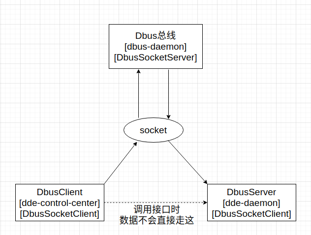
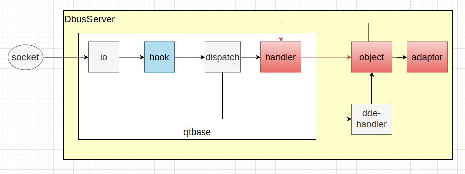

DbusSocketServer：dbus数据通信基于socket时，DbusSocketServer代表socket的服务端；

DbusSocketClient：dbus数据通信基于socket时，DbusSocketClient代表socket的客户端；

Dbus总线：属于DbusSocketServer，即dbus-daemon；

DbusServer：属于DbusSocketClient。会提供业务相关的dbus接口的服务，比如dde-daemon；

DbusClient：属于DbusSocketClient。不提供业务相关接口，相反是会需要调用DbusServer提供的接口，如dde-control-center；


1、"DbusSocketClient"和"Dbus总线"建立连接

无论dde-daemon（DbusServer）还是dde-control-center（DbusClient），同属于“DbusSocketClient”，和"Dbus总线"建立连接的流程是一样的；

以systemd的;;;;sdbus为例，sd_bus_open_user()建立连接的流程：

- 找到socket

  ```c
  // systemd/libsystemd/sd-bus/sd-bus.c
  int bus_set_address_user(sd_bus *b) {
          // ... 省略部分代码
          a = secure_getenv("DBUS_SESSION_BUS_ADDRESS");
  		// ... 省略部分代码
          r = sd_bus_set_address(b, a);
          // ... 省略部分代码
          return r;
  }
  // $ echo $DBUS_SESSION_BUS_ADDRESS
  // unix:path=/run/user/1000/bus
  ```

  

- 连接到socket

  ```c
  // systemd/libsystemd/sd-bus/bus-socket.c
  int bus_socket_connect(sd_bus *b) {
  		// ... 省略部分代码
          for (;;) {
              	// ... 省略部分代码
                  b->input_fd = socket(b->sockaddr.sa.sa_family, SOCK_STREAM|SOCK_CLOEXEC|SOCK_NONBLOCK, 0);
                  if (connect(b->input_fd, &b->sockaddr.sa, b->sockaddr_size) < 0) {
                         // ... 省略部分代码
                  } else
                          break;
          }
  		// ... 省略部分代码
  
          return bus_socket_start_auth(b);
  }
  ```

  - 创建dbus连接

    建立了socket连接不代表建立了dbus连接，dbus-daemon约定了dbus连接的规则，需要"DbusSocketClient"建立了socket连接后，发送指定协议的建立dbus连接数据，经过校验才算建立了dbus连接，这个约定就是dbus-daemon提供的Hello()接口。

    ```c
    // systemd/libsystemd/sd-bus/sd-bus.c
    static int bus_send_hello(sd_bus *bus) {
            // ... 省略部分代码
            r = sd_bus_message_new_method_call(
                            bus,
                            &m,
                            "org.freedesktop.DBus",
                            "/org/freedesktop/DBus",
                            "org.freedesktop.DBus",
                            "Hello");
    		// ... 省略部分代码
        	// sd_bus_call_async封装了socket数据协议的细节
            return sd_bus_call_async(bus, NULL, m, hello_callback, NULL, 0);
    }
    ```

    Hello()接口返回了这个dbus连接的UniqueId，如（:1.781）。

    > 总结1：UniqueId是唯一的，且和dbus连接绑定；

2、"Dbus总线"管理dbus连接

- "Dbus总线"创建并监听socket

  ```c
  // dbus/dbus/dbus-server-socket.c
  DBusServerListenResult _dbus_server_listen_socket (DBusAddressEntry *entry,
                              DBusServer      **server_p,
                              DBusError        *error)
  {
  	  // ... 省略部分代码
        host = dbus_address_entry_get_value (entry, "host");
        bind = dbus_address_entry_get_value (entry, "bind");
        port = dbus_address_entry_get_value (entry, "port");
        family = dbus_address_entry_get_value (entry, "family");
        *server_p = _dbus_server_new_for_tcp_socket (host, bind, port,
                                                     family, error, strcmp (method, "nonce-tcp") == 0 ? TRUE : FALSE);
  	  // ... 省略部分代码
  }
  ```

  _dbus_server_new_for_tcp_socket中有两个关键函数调用：

  （1）_dbus_listen_tcp_socket

  创建socket

  ```c
  // dbus/dbus/dbus-sysdeps-unix.c
  int _dbus_listen_tcp_socket (const char     *host, const char     *port, const char     *family,
                           DBusString     *retport, DBusSocket    **fds_p, DBusError      *error)
  {
   // ... 省略部分代码
    while (tmp)
      {
        DBusSocket *newlisten_fd;
        if (!_dbus_open_socket (&fd, tmp->ai_family, SOCK_STREAM, 0, error))
          {
             // ... 省略部分代码
          }
        if (bind (fd, (struct sockaddr*) tmp->ai_addr, tmp->ai_addrlen) < 0)
          {
       		// ... 省略部分代码
          }
  
        if (listen (fd, 30 /* backlog */) < 0)
          {
  			// ... 省略部分代码
          }
    // ... 省略部分代码
    return -1;
  }
  ```

  （2）_dbus_server_new_for_socket

  监听socket，循环accept，有socket客户端连接时，对应创建DBusTransport对象

  ```c
  // dbus/dbus/dbus-server-socket.c
  DBusServer* _dbus_server_new_for_socket (DBusSocket       *fds,
                               int               n_fds, const DBusString *address,
                               DBusNonceFile    *noncefile, DBusError        *error)
  {
    // ... 省略部分代码
    for (i = 0 ; i < n_fds ; i++)
      {
        DBusWatch *watch;
        watch = _dbus_watch_new (_dbus_socket_get_pollable (fds[i]),
                                 DBUS_WATCH_READABLE,
                                 TRUE,
                                 socket_handle_watch, socket_server,
                                 NULL);
         // ... 省略部分代码
      }
    // ... 省略部分代码
    return NULL;
  }
  static dbus_bool_t socket_handle_watch (DBusWatch    *watch,
                     unsigned int  flags, void         *data)
  {
      // ... 省略部分代码
  	client_fd = _dbus_accept (listen_fd);
      // ... 省略部分代码
  	handle_new_client_fd_and_unlock (server, client_fd); // 创建dbus_transport对象，并监听后续socket数据及处理
  	// ... 省略部分代码
  	return TRUE;
  }
  ```

  

3、"Dbus总线"的driver

driver是dbus-daemon的自身导出到总线的服务（org.freedesktop.DBus）的管理，提供包含Hello()、RequestName()等接口。

```c
// dbus/bus/driver.c
static const MessageHandler dbus_message_handlers[] = {
  { "Hello",
    "",
    DBUS_TYPE_STRING_AS_STRING,
    bus_driver_handle_hello,
    METHOD_FLAG_ANY_PATH },
  { "RequestName",
    DBUS_TYPE_STRING_AS_STRING DBUS_TYPE_UINT32_AS_STRING,
    DBUS_TYPE_UINT32_AS_STRING,
    bus_driver_handle_acquire_service,
    METHOD_FLAG_ANY_PATH },
  { "ReleaseName",
    DBUS_TYPE_STRING_AS_STRING,
    DBUS_TYPE_UINT32_AS_STRING,
    bus_driver_handle_release_service,
    METHOD_FLAG_ANY_PATH },
    // ... 省略部分代码
};
```


- 建立dbus连接 - Hello()

  "Dbus总线"对建立dbus连接请求的处理。

  socket连接，是对应DBusTransport对象；而dbus连接，是对应DBusConnection对象；

  如果"DbusSocketClient"成功调用Hello，则认为此DBusConnection激活；

  ```c
  // dbus/bus/driver.c
  static dbus_bool_t bus_driver_handle_hello (DBusConnection *connection,
                           BusTransaction *transaction,
                           DBusMessage    *message,
                           DBusError      *error)
  {
    DBusString unique_name;
    // ... 省略部分代码
    if (bus_connection_is_active (connection)) // 该函数就是判断connection的unique_name是否存在
      {
        /* We already handled an Hello message for this connection. */
        dbus_set_error (error, DBUS_ERROR_FAILED, "Already handled an Hello message");
        return FALSE;
      }
    // ... 省略部分代码
    if (!create_unique_client_name (registry, &unique_name)) // 创建unique_name
      {
        goto out_0;
      }
    // ... 省略部分代码
    if (!bus_driver_send_welcome_message (connection, message, transaction, error)) // 把unique_name返回给"DbusSocketClient"
      goto out_0;
    // ... 省略部分代码
    return retval;
  }
  
  // unique_name生成规则
  static dbus_bool_t create_unique_client_name (BusRegistry *registry,
                             DBusString  *str)
  {
    /* We never want to use the same unique client name twice, because
     * we want to guarantee that if you send a message to a given unique
     * name, you always get the same application. So we use two numbers
     * for INT_MAX * INT_MAX combinations, should be pretty safe against
     * wraparound.
     */
    /* FIXME these should be in BusRegistry rather than static vars */
    static int next_major_number = 0;
    static int next_minor_number = 0;
    int len;
    len = _dbus_string_get_length (str);
    while (TRUE)
      {
        /* start out with 1-0, go to 1-1, 1-2, 1-3,
         * up to 1-MAXINT, then 2-0, 2-1, etc.
         */
        if (next_minor_number <= 0)
          {
            next_major_number += 1;
            next_minor_number = 0;
            if (next_major_number <= 0)
              _dbus_assert_not_reached ("INT_MAX * INT_MAX clients were added");
          }
        _dbus_assert (next_major_number > 0);
        _dbus_assert (next_minor_number >= 0);
        /* appname:MAJOR-MINOR */
        if (!_dbus_string_append (str, ":"))
          return FALSE;
        if (!_dbus_string_append_int (str, next_major_number))
          return FALSE;
        if (!_dbus_string_append (str, "."))
          return FALSE;
        if (!_dbus_string_append_int (str, next_minor_number))
          return FALSE;
        next_minor_number += 1;
        /* Check if a client with the name exists */
        if (bus_registry_lookup (registry, str) == NULL)
  		break;
        /* drop the number again, try the next one. */
        _dbus_string_set_length (str, len);
      }
  
    return TRUE;
  }
  ```

- dbus服务 - RequestName()和GetNameOwner()

  "DbusSocketClient"如果是"DbusServer"，需要提供dbus接口，首先得申请一个dbus服务名；

  dbus服务对应BusService对象；

  ```c
  // dbus/bus/services.c
  struct BusService
  {
    int refcount;
    BusRegistry *registry;
    char *name;
    DBusList *owners; // owner是"DbusSocketClient"
  };
  ```

  可见BusService有一个"DbusSocketClient"的列表，这不是代表BusService可被多个"DbusSocketClient"拥有，实际上，BusService同时只能被一个"DbusSocketClient"拥有，

  通过GetNameOwner()可见，拥有BusService的"DbusSocketClient"是列表中的第一个owner，

  ```c
  // dbus/bus/driver.c
  static dbus_bool_t bus_driver_handle_get_service_owner (DBusConnection *connection,
  				     BusTransaction *transaction,
  				     DBusMessage    *message,
  				     DBusError      *error)
  {
    // ... 省略部分代码
        base_name = bus_connection_get_name (bus_service_get_primary_owners_connection (service));
    // ... 省略部分代码
    return FALSE;
  }
  // dbus/bus/services.c
  DBusConnection *bus_service_get_primary_owners_connection (BusService *service)
  {
    BusOwner *owner;
    owner = bus_service_get_primary_owner (service);
    if (owner != NULL)
      return owner->conn;
    else
      return NULL;
  }
  BusOwner *bus_service_get_primary_owner (BusService *service)
  {
    return _dbus_list_get_first (&service->owners);
  }
  ```

  "DbusSocketClient"的列表实际是一个队列，第一个owner是BusService实际拥有者，队列中其他owner是在排队等待获取该BusService，

  这是dbus提供的机制，RequestName时可指定参数，当申请的BusService已被其他owner拥有，可报错、可排队、可替代；

  ```c
  /* Owner flags */
  #define DBUS_NAME_FLAG_ALLOW_REPLACEMENT 0x1 /**< Allow another service to become the primary owner if requested */
  #define DBUS_NAME_FLAG_REPLACE_EXISTING  0x2 /**< Request to replace the current primary owner */
  #define DBUS_NAME_FLAG_DO_NOT_QUEUE      0x4 /**< If we can not become the primary owner do not place us in the queue */
  ```

  对于BusService的owner队列的处理，详细可见，RequestName()接口的bus_driver_handle_acquire_service，

  调用RequestName()接口的作用，就是在"Dbus总线"记录了BusService所属的"DbusSocketClient"是谁。

  >总结2：BusService只能同时被一个dbus连接拥有；

  

4、"Dbus总线"的dispatch

"DbusClient"调用"DbusServer"时，实际"DbusClient"作为一个"DbusSocketClient"，先把请求告诉"Dbus总线"，然后"Dbus总线"通过dispatch把请求转发给"DbusServer"；

```c
// dbus/bus/dispatch.c
static DBusHandlerResult bus_dispatch (DBusConnection *connection, DBusMessage    *message)
{
  // ... 省略部分代码, 对"DbusClient"的连接的一些校验
  // 获取被调用的"DbusServer"的BusService的Name
  service_name = dbus_message_get_destination (message); 
  if (service_name &&
      strcmp (service_name, DBUS_SERVICE_DBUS) == 0) /* to bus driver */
    {
      // 调用的不是"DbusServer"的场景，实际调用的是"org.freedesktop.DBus"的接口，请求转到driver
      if (!bus_driver_handle_message (connection, transaction, message, &error))
        goto out;
    }
  else if (service_name != NULL) /* route to named service */
    {
      // 请求即将转到"DbusServer"，先寻找BusService是否存在
      service = bus_registry_lookup (registry, &service_string);
      if (service == NULL && dbus_message_get_auto_start (message))
        {
          // BusService不存在，默认auto_start，自动创建BusService
          // 规则包含，通过dbus-1/services下的service文件找启动"DbusServer"
          if (!bus_activation_activate_service (activation, connection, transaction, TRUE,
                                                message, service_name, &error))
            {
              _dbus_verbose ("bus_activation_activate_service() failed: %s\n", error.name);
              goto out;
            }
          goto out;
        }
      else if (service == NULL)
        {
          // BusService不存在，不是认auto_start的场景
          if (!bus_transaction_capture (transaction, connection, NULL, message))
            {
              goto out;
            }
          dbus_set_error (&error, DBUS_ERROR_NAME_HAS_NO_OWNER, "Name \"%s\" does not exist", service_name);
          goto out;
        }
      else
        {
          // BusService存在，即将把调用请求转发给BusService的Owner，即"DbusServer"
          addressed_recipient = bus_service_get_primary_owners_connection (service);
          if (!bus_transaction_capture (transaction, connection,
                                        addressed_recipient, message))
            {
              goto out;
            }
        }
    }
  else /* service_name == NULL */
    {
      if (!bus_transaction_capture (transaction, connection, NULL, message))
        {
          goto out;
        }
    }
  // ... 省略部分代码
  // 把调用请求转发给BusService的Owner的实际处理
  if (!bus_dispatch_matches (transaction, connection, addressed_recipient, message, &error))
    goto out;
  // ... 省略部分代码
  return result;
}
```

自动创建BusService，

```c
// dbus/bus/activation.c
dbus_bool_t
bus_activation_activate_service (BusActivation  *activation,
                                 DBusConnection *connection,
                                 BusTransaction *transaction,
                                 dbus_bool_t     auto_activation,
                                 DBusMessage    *activation_message,
                                 const char     *service_name,
                                 DBusError      *error)
{
  // ... 省略部分代码
  if (bus_context_get_systemd_activation (activation->context) &&
      strcmp (service_name, "org.freedesktop.systemd1") == 0)
    {
      /* if we're doing systemd activation, we assume systemd will connect
       * eventually, and it does not need a .service file */
      entry = NULL;
    }
  else
    {
      entry = activation_find_entry (activation, service_name, error);
      if (!entry)
        return FALSE;
    }
    // ... 省略部分代码，自动创建BusService及相关，
}
// 找dbus-1/services/*.service文件
static BusActivationEntry *
activation_find_entry (BusActivation *activation,
                       const char    *service_name,
                       DBusError     *error)
{
  check_service_file (activation, entry, &updated_entry, error)
  if (!entry)
    {
      dbus_set_error (error, DBUS_ERROR_SERVICE_UNKNOWN, "The name %s was not provided by any .service files", service_name);
      return NULL;
    }
  return entry;
}
```

> 总结3：dbus总线判断如果被调用的 BusService不存在，会通过.service拉起BusService的进程；
>
> 总结4：一个dbus调用，如果BusService都不存在，那么该调用将由"Dbus总线"返错，如果BusService存在，那么"Dbus总线"把数据转发到"DbusServer"，"Dbus总线"基本不会关心转发的数据内容（需满足规定的格式即可）。


5，"DbusServer"能获取到调用数据的必要因素

"DbusServer"在调用Hello()和RequestName()后，就成功建立了dbus连接，此时，"DbusClient"调用接口，服务名是"DbusServer"中RequestName的服务名时，调用的请求数据就能够被转发到"DbusServer"，哪怕该调用的DbusPath和DbusInterface在"DbusServer"实际不存在；

看个例子：

（1）Service、Path、Interface都存在的场景

调用成功。

```shell
$ busctl --user call com.deepin.dbusdemo /com/deepin/dbusdemo com.deepin.dbusdemo Hello 
s "World"
```

（2）Service不存在

提示service不存在，报错文案由"Dbus总线"提供。参考dbus-daemon的bus_dispatch()的代码，该提示文案由dbus-daemon提供，dbus-daemon发现服务""不存在，默认auto_start模式去找.service，发现也找不到，最终返错；

```shell
$ busctl --user call com.deepin.dbusdemo111 /com/deepin/dbusdemo com.deepin.dbusdemo Hello 
The name com.deepin.dbusdemo111 was not provided by any .service files
```


（3）Service存在但Path不存在

Service存在，数据被转发到"DbusServer"，报错文案由"DbusServer"提供。

```shell
$ busctl --user call com.deepin.dbusdemo /com/deepin/dbusdemo111 com.deepin.dbusdemo Hello 
No such object path '/com/deepin/dbusdemo111'
```

这里的"DbusServer"是基于qtdbus实现的，参考qtbase中的qtdbus代码，

```c++
void QDBusConnectionPrivate::sendError(const QDBusMessage &msg, QDBusError::ErrorType code)
{
    if (code == QDBusError::UnknownMethod) {
        // ... 省略部分代码，其他错误类型
    } else if (code == QDBusError::UnknownObject) {
        send(msg.createErrorReply(QDBusError::UnknownObject, QLatin1String("No such object path '%1'").arg(msg.path())));
    }
}
```

另外，基于sdbus开发的"DbusServer"，Path不存在则不返错，而是阻塞，这意味着，"Dbus总线"在Service存在且转发数据后，后续的处理方式由"DbusServer"来自行决定。而通常来说，例如qtdbus和sdbus等sdk会封装一些较通用的规则，这些规则非"Dbus总线"的规则；


5，"DbusServer"导出的接口处理

"DbusServer"在sdbus中，由sd_bus_add_object_vtable来导出接口，

```c
// systemd/libsystemd/sd-bus/bus-objects.c
_public_ int sd_bus_add_object_vtable(
                sd_bus *bus,
                sd_bus_slot **slot,
                const char *path,
                const char *interface,
                const sd_bus_vtable *vtable,
                void *userdata) {
        return add_object_vtable_internal(bus, slot, path, interface, vtable, false, NULL, userdata);
}

static int add_object_vtable_internal(
                sd_bus *bus,
                sd_bus_slot **slot,
                const char *path,
                const char *interface,
                const sd_bus_vtable *vtable,
                bool fallback,
                sd_bus_object_find_t find,
                void *userdata) {
		// ... 省略部分代码
        // sdbus维护一个vtables，他包含DbusServer导出的Method、PROPERTY、Signal的信息
       	// 调用sd_bus_add_object_vtable导出时，如果存在则不重复添加到vtables
        LIST_FOREACH(vtables, i, n->vtables) {
                if (i->is_fallback != fallback) {
                        r = -EPROTOTYPE;
                        goto fail;
                }
                if (streq(i->interface, interface)) {
                        if (i->vtable == vtable) {
                                r = -EEXIST;
                                goto fail;
                        }
                        existing = i;
                }
        }
    	// 遍历依次添加到vtables
        for (v = bus_vtable_next(vtable, v); v->type != _SD_BUS_VTABLE_END; v = bus_vtable_next(vtable, v)) {

                switch (v->type) {

                case _SD_BUS_VTABLE_METHOD: {
                        struct vtable_member *m;
                        // ... 省略部分代码
                        m = new0(struct vtable_member, 1);
                        m->parent = &s->node_vtable;
                        m->path = n->path;
                        m->interface = s->node_vtable.interface;
                        m->member = v->x.method.member;
                        m->vtable = v;
                        r = hashmap_put(bus->vtable_methods, m, m);
                        break;
                }
                case _SD_BUS_VTABLE_WRITABLE_PROPERTY:
						// ... 省略部分代码
                case _SD_BUS_VTABLE_PROPERTY: {
                        // ... 省略部分代码
                        break;
                }

                case _SD_BUS_VTABLE_SIGNAL:
                        // ... 省略部分代码
                        break;
                default:
                }
        }
        LIST_INSERT_AFTER(vtables, n->vtables, existing, &s->node_vtable);
        return r;
}
```

通过代码可以发现，调用sd_bus_add_object_vtable后，整个处理过程"DbusServer"基本不需要"Dbus总线"通信，也就是还是前面的结论，DbusServer导出的内容"Dbus总线"并不关心。

那么例如d-feet等"DbusClient"怎么知道"DbusServer"导出的接口信息的？

"Dbus总线"会定义一个规范，"DbusServer"可选的提供一个接口"org.freedesktop.DBus.Introspectable"及方法Introspect ()，一些常用dbus的sdk，如sddbus会封装且自动提供Introspect ()的导出，d-feet获取到Server列表后，会调用Introspect ()，Introspect ()在sdbus的封装中，会根据vtables的数据，自动生成xml_data，返给d-feet，xml_data内容就是导出的内容。

```c
// systemd/libsystemd/sd-bus/bus-objects.c
static int process_introspect(
                sd_bus *bus,
                sd_bus_message *m,
                struct node *n,
                bool require_fallback,
                bool *found_object) {
        // ... 省略部分代码
        r = introspect_path(bus, m->path, n, require_fallback, false, found_object, &s, &error);
        // ... 省略部分代码
        return 1;
}
int introspect_path(
                sd_bus *bus,
                const char *path,
                struct node *n,
                bool require_fallback,
                bool ignore_nodes_modified,
                bool *found_object,
                char **ret,
                sd_bus_error *error) {
		// ... 省略部分代码
		n = hashmap_get(bus->nodes, path);
		// ... 省略部分代码		
        LIST_FOREACH(vtables, c, n->vtables) {
            // ... 省略部分代码
        	// 拼接xml数据
        }
    	// ... 省略部分代码
        return 1;
}
```

> 总结5：dbus总线本身对发送给DbusSocketClient的数据基本不会进行约束；但是在代码之外会约定一些通用规范；


6，dbus的Path的寻址规则

进一步的疑惑，d-feet怎么知道调用哪个Path的org.freedesktop.DBus.Introspectable的接口？

dbus规则还一个细节：自动Path寻址。

以实际导出的Path为"/com/demo"为例，每一个DbusServer都会导出"/"的Path，"/"Path的Introspect会包含一个<node>，指向下一个Path，如：

```xml
<node>
        <node name="com"/>
</node>
```

然后调用"/com"的Introspect，获取到"/com/demo"

dfeet的Path寻址：

```python
   # dfeet/introspection.py
    def introspect_start(self):
		# start introspection
        self.__object_paths_to_introspect.append("/")
        self.__dbus_node_introspect()
    def __dbus_node_introspect(self):
        object_path = self.__object_paths_to_introspect.pop(0)
        self.connection.call(
            self.name, object_path, 'org.freedesktop.DBus.Introspectable', 'Introspect',
            None, GLib.VariantType.new("(s)"), Gio.DBusCallFlags.NONE, -1,
            None, self.__dbus_node_introspect_cb, object_path)
    def __dbus_node_introspect_cb(self, connection, result_async, object_path):
        # ... 省略部分代码
            # are more nodes left?
            if len(node_info.nodes) > 0:
                for node in node_info.nodes:
                    # node_iter = self.__treemodel.append(tree_iter, [node.path, node])
                    if object_path == "/":
                        object_path = ""
                    self.__object_paths_to_introspect.append(object_path + "/" + node.path)

			# ... 省略部分代码
            # 递归__dbus_node_introspect
            self.__introspection_idle_id = GLib.idle_add(self.__dbus_node_introspect)
```


7，dbus的按需启动和权限控制

某个程序1（也可以是插件），提供dbus服务，如ServerName="com.demo"，Path="/com/demo"，Interface="com.demo"，Method={"Hello"}

某个程序2（也可以是插件），提供dbus服务，如ServerName="com.demo"，Path="/com/demo2"，Interface="com.demo"，Method={"Hello"}

现在考虑，在Hello被调用时，程序1和程序2才运行，即实现按需启动。

场景：

- 根据DbusService的Name来实现按需启动（Dbus总线方案）

  如果程序1和程序2都没运行，这时候调用"/com/demo"的“Hello”，参考上文，Dbus总线判断Server Name不存在，会去找dbus-1/services/x.service，x.service把程序1拉起来，实现成功的按需启动的调用。

- 根据Path来实现按需启动（DbusServer方案）

  程序1启动状态时，ServerName="com.demo"是存在的，此时调用"/com/demo2"的“Hello”，Dbus总线判断Server Name存在，会把调用数据转发给程序1，而程序1中是不存在Path="/com/demo2"的，因此调用失败，无法按需启动。

  解决思路，程序2可以作为程序1的一个插件，程序1能够拿到此次调用的数据，根据数据判断调用的Path="/com/demo2"，则先拉起程序2，实现按需启动。


DbusServer方案：



以qtdbus为例，"Dbus总线"通过socket把调用数据发给"DbusServer"后，正常流程可以没有hook和adapter环节，"DbusServer"获取数据后，解析数据，然后通过dispatch根据数据类型，把调用请求分发给object，object为具体的提供业务功能的对象；

- dbus-daemon方案

- hook方案

  在dispatch之前，先处理hook。

  这段代码在qtbase中，qtbase需提供一个注册hook的接口，qtbase不需要包含hook的实现，只需要在dispatch之前，先运行注册的hook。

  "DbusServer"使用qt去开发dbus接口时，实现hook，hook可以做Path的按需启动、接口私有化检验等，然后向qtbase注册hook。

  ```c++
  // qtbase/src/dbus/qdbusintegrator.cpp
  bool QDBusConnectionPrivate::handleMessage(const QDBusMessage &amsg)
  {
      const QDBusHookList *list = qDBusHookList();
      for (int i = 0; i < list->size(); ++i) {
          qDBusDebug() << "calling the message hook";
          (*(*list)[i])(amsg);
      }
      switch (amsg.type()) {
      case QDBusMessage::SignalMessage:
          handleSignal(amsg);
          return true;
          break;
      case QDBusMessage::MethodCallMessage:
          handleObjectCall(amsg);
          return true;
      case QDBusMessage::ReplyMessage:
      case QDBusMessage::ErrorMessage:
          return false;
      case QDBusMessage::InvalidMessage:
          Q_ASSERT_X(false, "QDBusConnection", "Invalid message found when processing");
          break;
      }
      return false;
  }
  ```

  

- adapter方案

  （1）定制生成的adapter代码，生成的代码中加预处理

  问题1: 必须提前加载插件库

  （2）使用QDBusVirtualObject

  每个插件独立的dbus连接->注册插件的服务->注册VirtualObject,并监控调用请求->处理请求, 取消VirtualObject的注册,注册实际对象-> [MetaCall 处理当前调用] or [VirtualObject返false, 不确定实际对象能否接管处理流程?]


