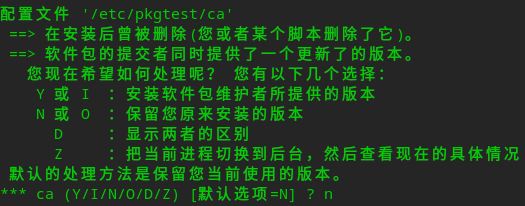
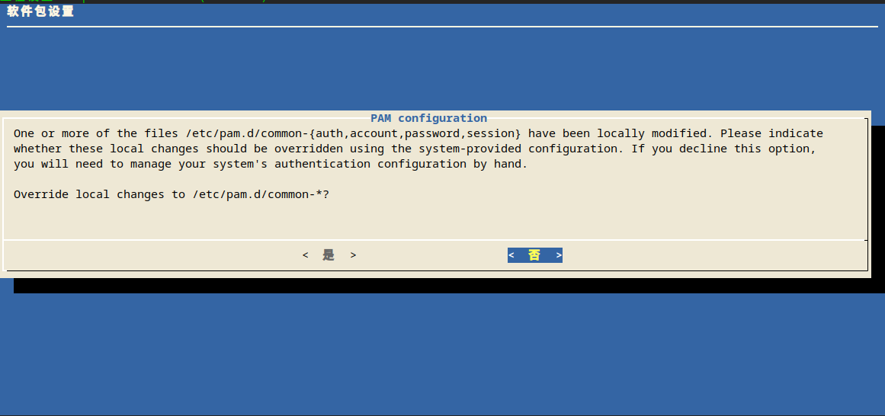

# deb安装时配置更新策略
deb安装时配置更新策略


## 1 概述
一些应用会在安装时，同时安装这个应用的配置文件，问题就是：

（1）这个配置文件被手动修改了，应用更新时配置也更新了，那么是否覆盖掉手动修改的配置。

（2）多个应用使用同一个配置文件时，怎么更新？


deb主要有2种方法来实现更新策略：

（1）dpkg策略



（2）debconf策略




## 2 dpkg策略
### 2.1 deb的配置组成
一个包的相关配置有3种

* deb包本身的配置
* dpkg缓存，dpkg-info
* dpkg缓存，dpkg-status

```bash
# 测试包 feng-pkgtest
uos@ccc:~/Desktop$ dpkg -L feng-pkgtest
/.
/etc
/etc/pkgtest
/etc/pkgtest/ca  # 配置文件，及 deb包本身的配置
/etc/pkgtest/feng-pkgtest # 二进制

# 安装后，生成dpkg-info
/var/lib/dpkg/info/feng-pkgtest.list         # 文件列表
/var/lib/dpkg/info/feng-pkgtest.md5sums
/var/lib/dpkg/info/feng-pkgtest.conffiles # 配置文件列表
# 安装后，生成dpkg-status
/var/lib/dpkg/status  # 所有包status都在这个文件中，其中feng-pkgtest包信息如下：
Package: feng-pkgtest
Status: install ok installed
Priority: optional
Section: devel
Installed-Size: 1339
Maintainer: Deepin Packages Builder <packages@deepin.com>
Architecture: amd64
Version: 1.0.3
Conffiles:
 /etc/pkgtest/ca 415a643ac7cbe0b5cb5b8570b5c7fcb0       # 配置文件hash（决定了包更新时的配置更新策略）
 /etc/pkgtest/feng-pkgtest c87104d6e9433c4aec4eb210c49640d1
Description: test
Homepage: http://www.deepin.org
```
### 2.2 deb配置的删除
* 删除包（保留配置）

```bash
sudo apt remove feng-pkgtest
# 删除后，会发现deb包本身的配置、dpkg-status都还保留，dpkg-info还保留feng-pkgtest.list
```
* 删除包（不保留配置）

```bash
sudo apt --purge remove feng-pkgtest
# 删除后，上述这个包的3种配置都删除了
```
### 2.3 配置更新机制
有时候包版本更新时，发现不会自动完成安装，而是会弹出提示，选择配置更新策略：

```bash
配置文件 '/etc/pkgtest/ca'
 ==> 在安装后曾被修改(您或者某个脚本修改了它)。
 ==> 软件包的提交者同时提供了一个更新了的版本。
   您现在希望如何处理呢？ 您有以下几个选择：
    Y 或 I  ：安装软件包维护者所提供的版本
    N 或 O  ：保留您原来安装的版本
      D     ：显示两者的区别
      Z     ：把当前进程切换到后台，然后查看现在的具体情况
 默认的处理方法是保留您当前使用的版本。
*** ca (Y/I/N/O/D/Z) [默认选项=N]
```
什么时候会提示，什么时候不会提示呢？

注意上文提到dpkg缓存中，dpkg-status有数据：

```bash
 /etc/pkgtest/ca 415a643ac7cbe0b5cb5b8570b5c7fcb0 # 配置文件hash（决定了包更新时的配置更新策略）
```
简单的说，安装包时会根据“配置文件hash”判定包是否有改变，从而来决定是否提示选择，

详细规则如下：

A，阶段1：dpkg-status缓存对比

A1, 安装包时，会去dpkg-status检查是否有已安装过的版本，如果没有进入B1，如果有进入A2.

A2, 检查新包的“配置文件hash”和dpkg-status中“配置文件hash”是否一致，如果一致，则跳过配置更新进入End1，如果不一致则进入B1.

（注：这也是为什么，明明手动把配置文件内容改了，重新安装这个包不会还原配置也不提示）

B，阶段2：文件系统文件对比

B1，到这里代表需要进行配置更新

B2，检查文件系统中，该包的配置文件的安装位置，是否已有配置，如果没有就进入End2, 如果已有配置，进入B3。

B3，计算已有配置的文件hash，然后和包的配置文件hash进行对比，如果一致如果就进入End2，如果不一致就进入End3.

End1, 不提示配置更新选项，不安装配置

End2, 不提示配置更新选项，直接安装配置

End3, 提示配置更新选项，根据选项策略来决定怎么安装配置。


### 2.4 静默安装
有时候不希望安装包过程中有手动操作，即不希望弹出提示配置更新。这时可以用-force来指定规则来处理而不是弹出提示。

```bash
# 从上述提示例子中可以看到，默认选项=N，即--force-all会不更新，也不弹出提示了
sudo dpkg --force-all -i feng-pkgtest_1.0.3.deb 

# dpkg --force 几个跟配置有关的参数
uos@ccc:/var/lib/dpkg$ dpkg --force-help
dpkg 强制选项 - 当遇到问题时控制软件行为：
  警告后仍然继续:     --force-<手段>,<手段>,...
  遇错即停:           --refuse-<手段>,<手段>,... | --no-force-<手段>,...
 可强制执行的“手段”:
  [!] confnew            总是使用新的配置文件，不提示
  [!] confold            总是使用旧的配置文件，不提示
  [!] confdef            当有新的配置文件时使用默认选项，不要提示。
                         如果找不到默认设置，将会有提示，除非打开
                         confold 或 confnew 选项
  [!] confmiss           总是安装缺失的配置文件
  [!] confask            建议不以新版本配置文件取代原有版本

  # eg1:始终更新
  sudo dpkg --force-confnew -i feng-pkgtest_1.0.3.deb 

 # eg1:始终不更新（不建议用默认，因为选项不可预知），另外除非需求很明确，不然不建议始终不更新， 因为配置不更新会导致新包功能不能正常使用
  sudo dpkg --force-confold -i feng-pkgtest_1.0.3.deb 
```
静默安装应用于apt：

```bash
# 1 直接指定
apt -o Dpkg::Options::="--force-confnew" install [your-your-package]

# 2 或apt配置文件指定
Dpkg::Options {
   "--force-confnew";
}
```
## 3 debconf策略
### 3.1 简介
debconf 是 Debian 使用的一种软件包配置方法。支持 debconf 的软件在安装时，会弹出对话框，要求用户输入一定配置参数。

debconf同deb的postinst脚本一样，目的是在安装包后进行配置，另外debconf一般也是在postinst中完成配置逻辑。


优点：

对比dpkg策略，debconf由脚本控制，可以可自由的维护配置，比如满足多个应用使用同一个配置。

比如pam，每个用了pam配置的应用，在/usr/share/pam-configs下每个文件对应每个应用本身的那些配置。然后在postinst中通过pam-auth-update脚本把这些配置合并。其中配置冲突时，会通过debconf来提供选项。


### 3.2 Debian 的 preinst, postinst, prerm, 和 postrm 脚本
这些是软件包安装前后自动运行的可执行脚本. 统称为控制文件, 是 Deian 软件包的"控制"部分它们是：

* preinst

Debian软件包(".deb")解压前执行的脚本, 为正在被升级的包停止相关服务,直到升级或安装完成。 (成功后执行 'postinst' 脚本)。

* postinst

主要完成软件包(".deb")安装完成后所需的配置工作. 通常, postinst 脚本要求用户输入, 和/或警告用户如果接受默认值, 应该记得按要求返回重新配置这个软件。 一个软件包安装或升级完成后，postinst 脚本驱动命令, 启动或重起相应的服务。

* prerm

停止一个软件包的相关进程, 要卸载软件包的相关文件前执行。

* postrm

修改相关文件或连接, 和/或卸载软件包所创建的文件。

当前的所有配置文件都可在 /var/lib/dpkg/info 目录下找到, 与 foo 软件包相关的命名以 "foo" 开头,以 "preinst", "postinst", 等为扩展。这个目录下的 foo.list 文件列出了软件包安装的所有文件。Debian里用apt-get安装或卸载软件时，会常发生前处理或后处理的错误，这时只要删除 对应的脚本文件，重新执行安装或卸载即可。


为deb添加脚本方法：项目debian目录，添加\[项目名\].postinst文件即可，debuild打包时，deb包就包含这些脚本了，可以dpkg-deb -R解压包，在DEBIAN子目录下。


### 3.3 实现debconf
这里只简单介绍一下。


3.3.1  如何在工程中加一个debconf？

在工程debian目录下添加\[项目名\].templates文件，参考如下

```bash
# feng-pkgtest.templates
Template: feng-pkgtest/override
Type: boolean
Default: false
Description: 111111111?
 222222222222222222222222
```
备注1：还可以指定Template翻译，这里不详述

备注2：如果使用了debconf，注意在rules增加debconf依赖


3.3.2  生成debconf的配置文件

（1）在安装deb后，自动安装debconf配置

生成2个缓存：

```bash
# debconf的配置设置，同工程目录的templates文件
var/lib/dpkg/info/feng-pkgtest.templates
# debconf的当前配置
/var/cache/debconf/templates.dat
```
/var/cache/debconf/templates.dat参考如下：

```bash
# /var/cache/debconf/templates.dat
Name: feng-pkgtest/override
Value: false
Description: 111111111?
Extended_description: 222222222222222222222222
Owners: feng-pkgtest/override
Flags: seen # 有seen代表配置过，不再弹框
```
（2）dpkg-preconfigure

用sudo dpkg-preconfigure feng-pkgtest\_1.0.4\_amd64.deb预配置。

该命令不会实际安装包，只会提前生成/var/cache/debconf/templates.dat

如果不希望在安装包时再去配置（比如不希望安装包时弹框），可以预配置。

但是该命令只是生成templates.dat缓存，没有实际进行配置，方法见下文。


3.3.3 debconf配置方法

生成debconf配置后，如何去选择配置的各个选项呢？

（1）postinst脚本

在postinst脚本引入confmodule，之后可以在脚本中用confmodule语法去配置，这里不详细说明confmodule语法。见《参考1》

```bash
# feng-pkgtest.postinst
#!/bin/sh -e
. /usr/share/debconf/confmodule
# to use debconf
```
（2）其他脚本

在postinst脚本可以调用其他语言的脚本，比如perl，然后在perl脚本中去配置debconf，  

```perl
#!/usr/bin/perl -w
use Debconf::Client::ConfModule ':all';


my $overridetemplate = 'feng-pkgtest/override';
x_loadtemplatefile('/var/lib/dpkg/info/feng-pkgtest.templates','feng-pkgtest');

# 这里弹框，feng-pkgtest/override的类型是bool，所以弹框选择是和否
# 并且在选择后，/var/cache/debconf/templates.dat中增加Flags: seen，也就是下次执行该脚本，不再弹框
input('high',$overridetemplate);
go();


# 去掉Flags: seen，下次还弹框
# fset($overridetemplate,'seen','false');
```
（3）命令行预配置

见《参考3》。

模板导入之后，可以使用 debconf-set-selections 设置软件配置。用下面的命令：

```bash
# debconf-set-selections
debconf mysql-server-5.0/start_on_boot select true
debconf mysql-server-5.0/start_on_boot seen true
(ctrl+d)
```
上面命令将 mysql-server-5.0/start\_on\_boot 设置为 true，并且设置配置项已经显示（区分配置项的值是默认值，还是用户输入值）。一般来说，软件安装时，只会显示 seen 为 false 的那些配置参数。


如果不知道软件有哪些配置选项，可以用 debconf-show 看到：

```bash
# debconf-show mysql-server-5.0
mysql-server/root_password_again: (password omitted)
* mysql-server/root_password: (password omitted)
mysql-server-5.0/really_downgrade: false
mysql-server-5.0/need_sarge_compat: false
mysql-server-5.0/start_on_boot: true
mysql-server/error_setting_password:
mysql-server-5.0/nis_warning:
mysql-server-5.0/postrm_remove_databases: false
mysql-server-5.0/need_sarge_compat_done: true
mysql-server/password_mismatch:
```
上面每行输出中第一个 \* 表示 seen 为 true，没有星号表示 seen 为 false；每行输出中，冒号前面配置项，冒号后是值。

上述命令完成了选项的配置及设置了flag为seen，安装在之后安装该包时，不再弹框。


### 3.4 静默安装
方法1：

在脚本中，提前设置seen状态为true。

方法2：

命令行debconf-set-selections，设置seen状态为true。


方法3：DEBIAN\_FRONTEND

在Debian系列的操作系统中，内核支持多个安装参数，DEBIAN\_FRONTEND就是其中之一，用以设置安装过程中的用户界面类型。

DEBIAN\_FRONTEND=noninteractive|text|newt|gtk|corba

默认值为 newt，而在自动化安装过程中，使用最频繁的还是noninteractive。

```bash
# 忽略debconf弹框进行更新的例子
root@PC:/# export DEBIAN_FRONTEND=noninteractive && export DEBCONF_NONINTERACTIVE_SEEN=true && apt -y dist-upgrade
```
## 4 静默安装结合的例子
```cpp
root@PC:/# export DEBIAN_FRONTEND=noninteractive && export DEBCONF_NONINTERACTIVE_SEEN=true && sudo apt -y -o Dpkg::Options::="--force-confnew" dist-upgrade
```
---
参考1：[https://blog.csdn.net/u013390088/article/details/81566696](https://blog.csdn.net/u013390088/article/details/81566696)

参考2：《[debconf开发者手册](http://www.fifi.org/doc/debconf-doc/tutorial.html)》[http://www.fifi.org/doc/debconf-doc/tutorial.html](http://www.fifi.org/doc/debconf-doc/tutorial.html)

参考3：《debconf预配置方法》http://blog.chinaunix.net/uid-23225855-id-2875330.html