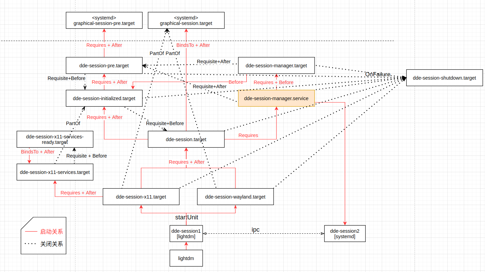
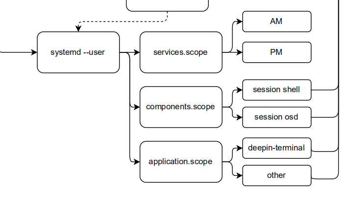
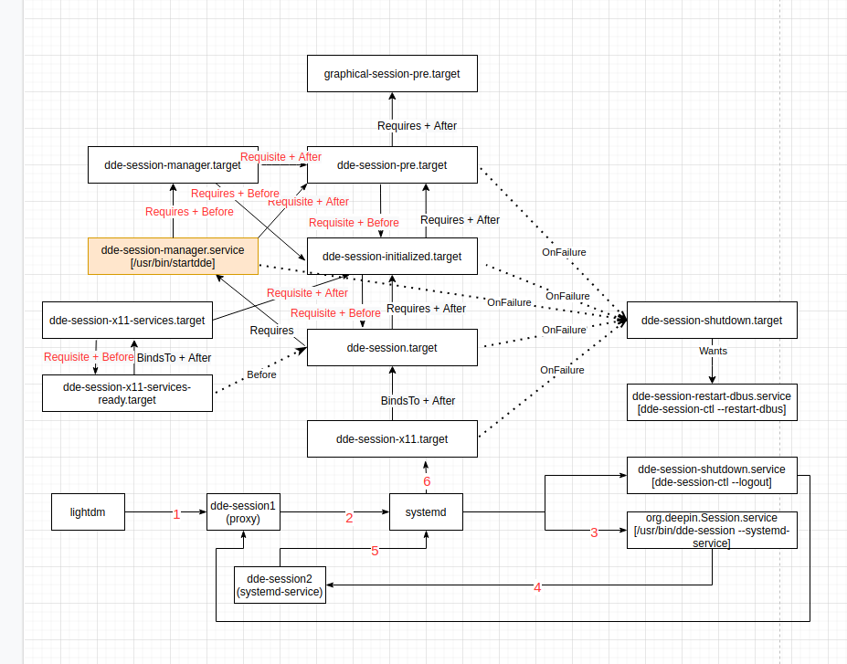
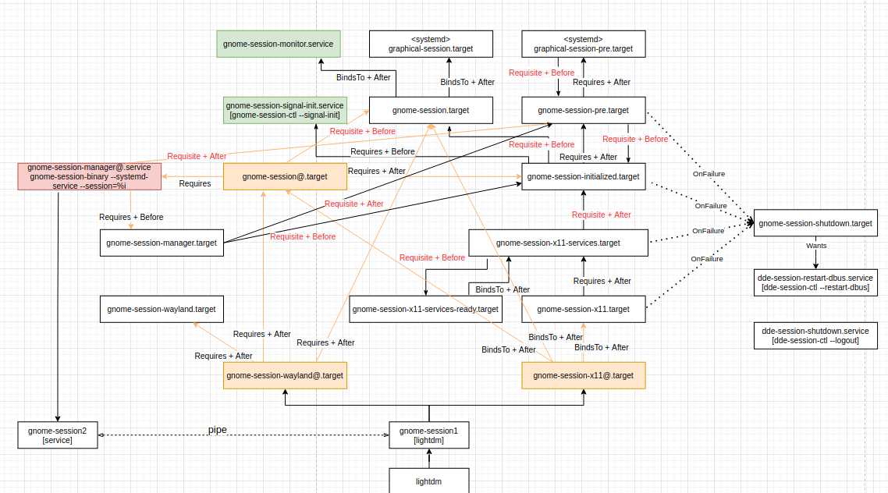

# 一、startdde

V20的startdde主要包含一下组成：

- sessionManager

  迁移到dde-session

- watchDog

  迁移到dde-session

- startManager

  迁移到AM

- autostart

  迁移到AM

- display

  保留，startdde命名改为dde-display

- xsetting

  保留，后续也考虑拆出去


# 二、dde-session

替代了startdde作为桌面服务入口，lightdm完成认证后，首先启动dde-session

```shell
# /usr/share/xsessions/deepin.desktop
[Desktop Entry]
Name=deepin
Comment=Deepin Desktop Environment
Exec=/usr/bin/dde-session
TryExec=/usr/bin/dde-session
```

dde-session会用systemd来实现桌面服务的启动


- dde-session维护的systemd-unit关系




dde-session会运行两个进程：dde-session1[lightdm]、dde-session2[systemd]

> 1，lightdm认证完成后会拉起dde-session1，dde-session1会拉起systemd的各个unit，根据X11或wayland，unit入口为dde-session-x11.target或dde-session-wayland.target
>
> 2，systemd-unit中的dde-session-manager.service会拉起dde-session2，startdde中迁移过来的sessionManager会放在dde-session2。
>
> 3，systemd的机制，根据systemd的unit互相之间的依赖关系，可以自动控制各个unit的启停，因此可以做到dde-session1只用拉起一个target，所有桌面核心服务都能被拉起来，且异常的时候相关服务可以一起退出。


- 为什么两个dde-session？

lightdm机制dde-session1是不能作为一个systemd-unit存在的，不方便参与到systemd体系中；且de-session1会在各systemd-unit之前启动，有些session操作需要延后。所以提供一个作为systemd-unit成员的dde-session2。dde-session1和dde-session1会维持通信，把lightdm体系和systemd体系关联起来。


- systemd的unit的启动流程控制？

dde-session-pre.target、dde-session-init.target、dde-session.target是按顺序启动的，在核心服务启动过程中，会存在顺序问题，所以例如可以把最早需要启动的放到dde-session-pre.target节点启动。


- 服务管理



用slice替代scope来分组。通过分组可实现一类服务的统一管理及资源控制。

包含services.slice、components.slice、applications.slice 。

applications.slice会细分为applications-freedesktop.slice、applications-linglong.slice、applications-android.slice等


- service例子，提供给后面做参考

```shell
[Unit]
Description=dde session daemon service
RefuseManualStart=no
RefuseManualStop=no
#OnFailure=dde-session-shutdown.target   # 有些服务应该一直重启，不应该触发退出session
OnFailureJobMode=replace-irreversibly
CollectMode=inactive-or-failed
StartLimitIntervalSec=0 # service的重启

PartOf=dde-session-manager.target
After=dde-session-manager.target
Before=dde-session-initialized.target # 启动顺序控制

# equal Service Type is dbus
Requires=dbus.socket
After=dbus.socket

Requires=dde-session-daemon.target # 提供给依赖dde-session-daemon的unit
PartOf=dde-session-daemon.target
Before=dde-session-daemon.target

[Service]
Type=notify # service启动方式
NotifyAccess=all
ExecStart=/usr/lib/deepin-daemon/dde-session-daemon
TimeoutStartSec=infinity
Slice=services.slice # slice
Restart=on-failure
```


- service的启动unit配置

对于流程比较严格的服务，用notify方式来启动服务。


- service的退出unit配置

  除了dde-session体系的unit故障外，其他unit故障不会触发dde-session-shutdown.target，而是核心常驻服务会不限制次数的一直重启

  

- 其他服务如何参与到dde-session的systemd体系中？

比如dde-session-daemon.service，不由dde-session来维护，dde-session只维护如上图的systemd-unit框架。dde-session-daemon项目来维护dde-session-daemon.service，dde-session-daemon.service中通过Requiers等设置来dde-session-daemon服务应该位于dde-session的systemd-unit框架什么位置。然后dde-session-daemon项目通过把services链接到dde-session-xxx.target.wants/来让systemd自动拉起dde-session-daemon.services服务。


- service的启动方式

有3种方式：

1、按需启动，由dbus拉起。

2、常驻，services链接到dde-session-xxx.target.wants/来让systemd自动拉起

3、常驻，dde-session中通过systemd的dbus接口拉起

> 第3种方式类似startdde的watchdog，后续会都替换为第2种方式。暂时没替换是因为:
>
> 1, service启动前的逻辑处理
>
> ​	如根据判断kwin状态来决定dde-dock的启动参数，第2种方式没法做前置逻辑处理。类似问题后续需要将这部分逻辑移到对应自身去处理。
>
> 2，延时启动
>
> ​	性能优化考虑，部分服务会延时启动。第2种方式目前没找到方法，后面会调研一下。


- systemd-unit退出方式

有两种方式：

1、dde-session-shutdown去停掉*.slice，优点是简单没有遗漏，缺点是没法控制停止顺序。V20的session-2.scope类似这种方式。

2、通过systemd-uint的requies、bindto等依赖来自动停止。优点是能控制停止顺序，缺点是unit的配置比较麻烦。每个unit都需要配置。

将采用结合的方式，核心服务由第2种方式关闭，dde-session-shutdown在核心服务关闭后才开始停掉*.slice


- dde-session1和dde-session1的通信做了什么？

退出通知和sessionId。

sessionId：登陆后，systemd会创建一个session级的session-2.scope，后续运行的应用的进程属于session-2.scope，即session-2.scope是当前session的作用域。

如，org.freedesktop.login1.Manager的GetSessionByPID方法，只能通过session-2.scope下的进程的pid才能正确找到当前session。


但，dde-session2及services.slice下的unit也应该属于当前session，因此通过通信告诉dde-session2 sessionId，dde-session2充当了对session-2.scope外的服务进行session作用域管理的作用。


- 原systemd-unit关系




差异：

1，dde-session2的启动时间

2，unit关系

3，dde-session的dbus服务在dde-session1


- gnome的systemd-unit关系




# 三、dde-permission-manager

https://doc.uniontech.com/docs/loqeWOgKnzfQDgAn

PM对桌面框架影响较小，核心设计：

- 权限实例解耦：PM不维护任何权限实例相关东西，做到权限实例变更无需修改。（案例：翻译文案）

- 组策略：应用配置转移到组策略。后续需求增加了系统级配置，组策略可简单的提供系统配置和用户配置。

  组策略后续优化，由于组策略不支持运行态新增key，PM太多数据集中在有限几个key。方案为采用分布式组策略key或者组策略提供模版功能。

- 权限组：用权限组来区分权限的版本，或者不用项目的权限。

- 权限注册机制：权限实例提供registerMode配置，limit类型权限未注册将被限制使用。通过注册权限来提供权限及设置预装应用权限。


# 四、dde-application-manager


1，应用管理框架

为方便兼容linglong等其它类型应用， 接口中传desktop文件名的参数统一修改为desktop文件全路径，AM解析为appId，例如  /linglong/user/dde-camera、/freedesktop/system/music。


2，loader

AM中loader加载，根据应用类型分别进行加载操作。

缺点：启动一个应用需要额外增加两个到三个常驻loader进程，在开启多应用情况下会大大增加系统常驻进程数量。

AM加载的是第三方，不算在进程统计。


3，引出后端服务结构

目前dock、launcher模块提供各自模块相关功能，在合并到AM后，结构需要进行修改。对dock、luancher模块进行拆分为三部分。

- AM中仅保存应用相关功能，如IsDocked、RequestDock功能接口

- 无需后端保存的配置前端应用保存，如SetUseProxy、SetDisableScaling等后端提供读写接口，和后端逻辑无关，可由前端保存

- 需后端常驻但非AM相关功能，如GetPluginSettings、RemovePluginSettings、SetPluginSettings等需常驻但和AM无关接口 

上述拆分的三个部分中第一部分需合入AM中，将服务接口统一曝露在org.desktopspec.ApplicationManager。

4，其他

建议：dde-dock分两个或多个部分启动，先画出任务栏界面，再加载其它部分，无需等待后端Dock服务，保证任务栏启动速度。 


控制中心等DDE应用不走AM


# 五、问题


1、DDE需要做到按需启动，DDE 整体相对V20 内存必须要降低（V23系统整体内存需要降低到500多M）

2、sprint1针对V23后端添加记录访问旧path的日志，用于分析被外部调用的公共接口

> 已提供日志收集工具，且已采集数据
>
> 采集结果，https://doc.uniontech.com/sheets/htGppK3hyCGTXctX/Vm2FC，后续会进行数据分析

3、只针对公共接口需要兼容考虑V20接口（可以根据sprint1的日志结果，确定DDE的公共接口）

4、lastore-daemon的服务是否需要放到daemon服务中（现在实现是按需启动，但是李鹤反馈社区版一直再后台期待，评估下，如果必须要常驻，就移到daemon服务）

>  经确认，1051的lastore-daemon已是按需启动，且没有一直在后台。

5、针对daemon实现go进程，针对pid指定可以访问的进程，需要添加调试的白名单，防止被外部接口直接调用

> dbus接口的隐私和权限，后续讨论

6、确定常驻进程列表，后期不再改变，补充到架构设计文档中

> 后续再确认

7、插件化方案：针对AM、PM、dde-session等新增后端C++代码，建议通过插件化实现，可参考source manager的方案；---考虑sprint2之后的版本分步上线  

8、确认github的接口规范内容是否符合预期，后续要按此规范落地实施：deepin-styleguide

> sprint2落实


