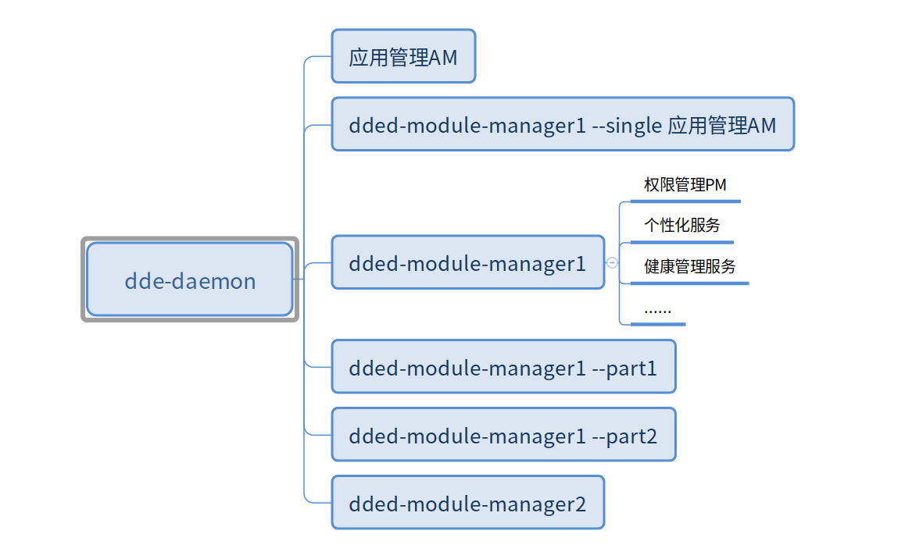

# 结构图



分两级：

第一级是一个模块管理，以进程的方式运行，比如dded-module-manager1是一个插件管理进程；模块的主要作用是控制进程资源和systemd统一处理；

第二级同进程下的插件管理；


# 模块管理

### 1、进程资源

对通过dde-daemon启动的模块的进程资源进行管控，***提供但不限于***对进程的NI和OOM进行配置；

dde-daemon只管理属于其的模块的进程资源；如果某项目需要使用该功能可以加入dde-daemon；

- NI（运行优先级）

  调整过nice值可以设置进程的调度优先级；

  ```shell
    PID USER      PR  NI    VIRT    RES    SHR S  %CPU  %MEM    TIME+  COMMAND 
  30985 uos       20   0    8332    744    680 S   0.0   0.0   0:00.00 sleep                                                 
  31026 uos       20   0   11576   5316   3576 S   0.0   0.0   0:00.01 bash                                                 
  31856 root      20   0       0      0      0 I   0.3   0.0   0:00.01 kworker/u32:1-events_unbound                         
  31941 root      20   0       0      0      0 I   0.0   0.0   0:00.00 kworker/9:0-cgroup_destroy                           
      3 root       0 -20       0      0      0 I   0.0   0.0   0:00.00 rcu_gp
      6 root       0 -20       0      0      0 I   0.0   0.0   0:00.00 kworker/0:0H-kblockd                                 
      8 root       0 -20       0      0      0 I   0.0   0.0   0:00.00 mm_percpu_wq 
  ```

- OOM（退出优先级）

  每个进程都有一个OOM权重，当系统分配不出内存时(触发条件)会触发这个机制，由系统在已有进程中挑选一个占用内存较多，回收内存收益最大的进程杀掉来释放内存。

  可以通过配置进程的OOM权重来避免核心服务被杀死，优先杀死不重要进程；

  ```shell
  # 如ssh进程，但设置过oom来保护不被杀掉
  $ cat /proc/1903/oom_adj 
  -17
  ```

### 2、systemd统一处理

简单的说，模块可以无需关心systemd的配置，由dde-daemon统一自动处理；

目前只实现自动生成systemd的service，把模块运行到service下，使用该方式实现模块的进程的自动重启等；

考虑通用性，模块也可以提供service，不使用自动生成的service；

二级插件不由systemd管理，遵循插件管理的规范；

### 3、设计自由度

在后续设计上提供了自由度，dded-module-manager1插件管理也只是一个模块：

- 版本兼容性

  dded-module-manager1是V1版本，约定了V1版本的插件规范，如果规范升级到V2，那么dded-module-manager1和dded-module-manager2可以并存实现兼容性，且可自动识别是否存在V1的插件，如果没有dded-module-manager1可以不用运行；

- 提供多种类型的插件管理

  如AM属于应用启动管理；

- 插件管理的分布式运行

  分布式场景运行见下文；


4、模块和插件的配置

虽然类似qtmeta等可实现提供隐式插件配置方法，但针对多场景，便于做到统一配置方式，模块和插件都要求在安装后提供安装到指定目录的配置文件；


# 插件管理（dded-module-manager1）

一个插件管理进程；

### 1、插件规范

插件指一个动态库，规范插件的入口，插件可由dded-module-manager1加载并启动；

不符合规范的插件不会被加载；

dded-module-manager1-dev提供dbus的sdk，插件如果是dbus接口服务，需要使用该sdk；

### 2、dded-module-manager1-dev

提供dbus的sdk，用于封装dbus的一些预处理，如，根据dbus调用按需启动、接口权限等；

如果要实现对不同编程语言的插件的支持，因为第三方dbus库的不同，要么就得提供对应第三方dbus库的sdk，这里可以约定只支持几种场景下的第三方dbus；

- sdbud

  systemd提供的dbus库，C语言开发，代码开源，更新频率高；该库有非官方的C++封装版本；

  ```c++
  sd_bus *bus = NULL;
  int sd_bus_message_handler(sd_bus_message *m, void *userdata, sd_bus_error *ret_error)
  {
      std::string path = std::string(sd_bus_message_get_path(m));
      if (path == "/org/deepin/demo/sdbus/test2") {
          // 实现按需启动 
          static bool isAdd2= false;
          sd_bus_slot *slot = NULL;
          if (!isAdd2) {
              if (sd_bus_add_object_vtable(bus, &slot,
                                              "/org/deepin/demo/sdbus/test2",  /* object path */
                                              "org.deepin.demo.sdbus.test2",   /* interface name */
                                              calculator_vtable2, NULL) < 0) {
                  return -1;
              }
              isAdd2 = true;
          }
      }
      return 0;
  }
  int server2(int argc, char **argv)
  {
      sd_bus_slot *slot = NULL;
      if (sd_bus_open_user(&bus) < 0) {
          return -1;
      }
      // eg unique: 8.1201
      const char *unique;
      sd_bus_get_unique_name(bus, &unique);
  
      if (sd_bus_add_object_vtable(bus, &slot,
                                       "/org/deepin/demo/sdbus/test",  /* object path */
                                       "org.deepin.demo.sdbus.test",   /* interface name */
                                       calculator_vtable,
                                       NULL) < 0) {
          return -1;
      }
      if (sd_bus_add_filter(bus, &slot, sd_bus_message_handler, NULL) < 0) {
          return -1;
      }
      return 0;
  }
  ```

  

- qtdbus

  qt官方dbus库，目前使用较多，但是做预处理需要修改qtbase；

  ```c++
  // qtbase/src/dbus/qdbusintegrator.cpp
  bool QDBusConnectionPrivate::handleMessage(const QDBusMessage &amsg)
  {
      const QDBusSpyHookList *list = qDBusSpyHookList();
      for (int i = 0; i < list->size(); ++i) {
          qDBusDebug() << "calling the message spy hook";
          (*(*list)[i])(amsg);
      }
      switch (amsg.type()) {
      case QDBusMessage::SignalMessage:
          handleSignal(amsg);
          return true;
          break;
      case QDBusMessage::MethodCallMessage:
          handleObjectCall(amsg);
          return true;
      case QDBusMessage::ReplyMessage:
      case QDBusMessage::ErrorMessage:
          return false;
      case QDBusMessage::InvalidMessage:
          Q_ASSERT_X(false, "QDBusConnection", "Invalid message found when processing");
          break;
      }
      return false;
  }
  ```

- gdbus

  上游系统项目较多使用，属于glib库；（TODO：用法待调研）


不同sdk插件会流程的差异，原则上由sdk封装差异，保证插件主要流程一致（通用注册的回调处理）。


### 3、插件的按需启动

提供dbus的接口才支持按需启动，不提供dbus接口的服务只能常驻运行；

实现按需启动有两种方法：dbus-daemon的配置、dbus请求预处理；

- dbus-daemon的配置

  /usr/share/dbus-1/services下的*.service来配置按需启动；

  ```shell
  # /usr/share/dbus-1/services/com.deepin.test1.service
  [D-BUS Service]
  Name=com.deepin.test1
  Exec=/usr/bin/false
  SystemdService=com.test1.service # com.test1.service实际运行hello进程
  ```

  对一个dbus服务（如com.deepin.test1）发起一个调用时，先检查dbus总线中该dbus服务是否已经运行，如果是则直接调用。

  如果该dbus服务未运行，会去/usr/share/dbus-1/services/找是否有该服务的service文件，如果没有则调用失败。

  如果有，则根据service文件来启动该dbus服务。

  ***如果没有配置“SystemdService”， 该dbus服务会直接运行“Exec”指定的二进制完成启动；***

  > 1, 在dbus服务未启动完成前，如果多个调用请求拉起同一个dbus服务（如com.deepin.test1.service），最终只会运行一个hello进程；
  >
  > 2, 在dbus服务未启动完成前，如果多个调用请求拉起不同一个dbus服务（如com.deepin.test1.service和com.deepin.test2.service，com.deepin.test2.service的Exec也是“/home/feng08/code/go/src/hello/hello”）。最终会运行两个hello进程；

  ***如果配置了“SystemdService”， 该dbus服务会通过start com.test1.service的systemd服务来完成启动；***

  > 1, 如果调用请求拉起同一个dbus服务（如com.deepin.test1.service），在systemd服务com.test1.service实际启动完成前，
  >
  > 通过别的方式start com.test1.service，最终只会运行一个hello进程；

  ***该方式的缺点：需要提前提供dbus的service文件，且只支持DbusName为对象的按需启动，无法按需启动已存在的DbusName下的Path接口；***

- dbus请求预处理（采取该方案）

  见*<dded-module-manager1-dev>*小节，通过预处理实现按需启动，可以实现已存在的DbusName情况下，对新增PATH的按需启动；

  ***该方式的缺点： 只有RequestName之后，才会监控该Name的请求；***

  这里有一个规范正在考虑（TODO：待调研）：

  > 1，通过对插件的dbusName进行检测，找到所有的DbusName的列表，然后全部RequestName；
  >
  > 2，sdk通过cmake宏，封装隐私实现插件自动生成dbus的service，该service会给dded-module-manager1指令，去RequestName对应的Name；
  >
  > 3，通过规范约束每个dded-module-manager1只允许提供一个DbusName；

### 4、关于DbusName的唯一性问题及相关设计（TODO：待调研）

因此，同servicename的插件，只允许用同一个sdk。不止在服务框架内，对于servicename，目前所有服务命名都没有约束，也没有验重机制，都是人为避免这种情况。服务框架可以提供在安装时校验是否合法？

DbusName会被一个连接独占，会对设计造成较大的影响：

> 1，不同dbus的sdk（如gdbus、qtdbus）在不修改sdk机制前提下，建立的dbus连接不同，也就是说不同sdk无法request相同的DbusName；
>
> 2，如果有多个dded-module-manager1，每个dded-module-manager1不能存在相同的DbusName；

### 5、插件管理的崩溃处理

（暂时不会实现，后续有时间继续调研）

由于dded-module-manager1所有插件在一个进程，对稳定性会有较大考验，一个插件异常导致进程崩溃会导致所有插件受影响；

如果能自动捕捉到崩溃的原因，那么好处理多了，但研究了一些方法都不太行；

目前可以通过不关心崩溃原因，进行插件管理分布式运行方法来实现；


### 6，插件的DbusName约定

每个插件的DbusName不允许重复；

后续可以提供插件接口冲突检测；


### 7，插件的生命周期和卸载

按需启动才需要卸载，而dbus接口服务才有按需启动，因此在sdk中根据dbus被调用情况封装自动退出的处理；

如果配置不需要sdk的自动退出，插件自行维护退出逻辑，通过插件规范通知插件管理；

插件的退出指的是卸载插件，但实际这里只从释放插件的dbus对象来释放内存，有两个原因（TODO：继续调研）：

- dlclose并不能释放调加载的动态库，除非进程退出 

  >POSIX标准实际上不需要dlclose从地址空间卸载库：
  >
  >Although a dlclose() operation *is not required to remove structures*
  >*from an address space*, neither is an implementation prohibited from
  >doing so.

- 插件的动态库会被共享，不能算浪费


### 8，UI

dded-module-manager1不会去支持UI，有UI的可以通过提供其他的一级模块来支持。（TODO：继续调研）


### 9， 权限管理

规范定义权限配置，在上述dbus预处理进程校验；

（疑问：会话解决什么问题？证书？信号监听永久会话？服务重启会话中断？）


### 10，dbus通信加密

通过sdk封装，支持国密


### 11，dded-module-manager1的独立模式


# V20接口兼容概述

根据清单，需要兼容接口分以下几种情况：

- V20需要兼容，V23继续提供该接口

  很多涉及系统资源的服务，如果存在两个，经过验证会存在冲突问题；

  因此只保留V23提供的服务，然后提供一个适配服务，该适配服务提供需要兼容的V20接口，转发请求给V23服务；

  涉及子dbus interface的，适配服务也会模拟一个V20的子dbus interface；

  这类接口理论上以后会从golang的dde-daemon拆出来，作为独立的服务或者插件；

- V20需要兼容，V23已不需要该接口

  保留V20的dde-daemon（也就是说，V20的dde-daemon需要继续运行，但只为了兼容而存在，如果不需要兼容V20的时候，V20的dde-daemon不再需要；目前阶段，会和第一种场景的V23服务共存在dde-daemon中）

  适配服务已提供的接口，在V20的dde-daemon不再提供；

  

- 被转移其他部门的接口（如外设、显示）

  最好由窗管来做兼容，如果不行，就也在适配服务处理
