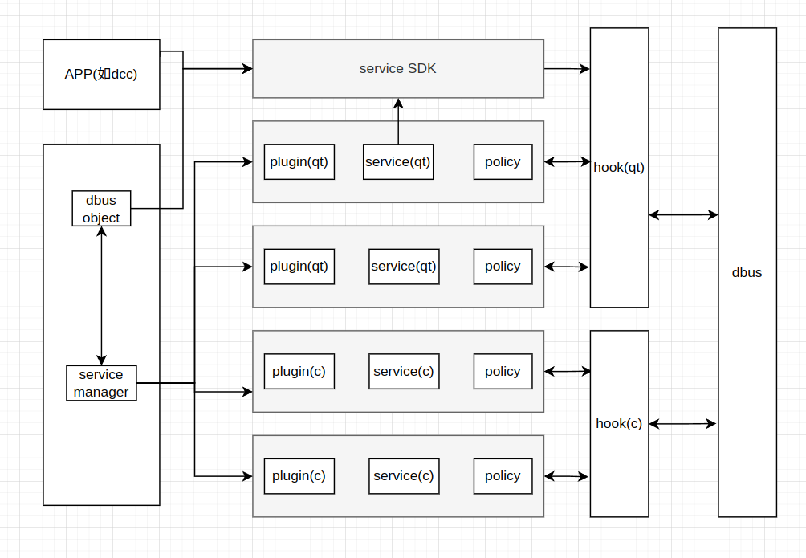

## 1 概述和用法

### 1.1 核心需求

- 插件服务，把服务以一个插件方式加载运行
- dbus接口私有化（接口隐藏、接口白名单）
- dbus插件服务的按需启动
- 独立应用的dbus接口私有化sdk


### 1.2 无接口私有化功能的插件开发

（1） 提供配置文件

```json
{
    "name":"org.deepin.services.sdbus.demo1", // dbus name，框架中会注册该name
    "libPath":"xxxx.so"
}
```

（2） 实现入口函数

- qdbus

```c++

#include "service.h" // 实现的dbusobject，基本支持qdbus原规则
#include <QDBusConnection>

// name:dbus name,配置文件中的"name"，
// data:自定义数据
extern "C" int DSMRegisterObject(const char *name, void *data)
{
    QDBusConnection::RegisterOptions opts = QDBusConnection::ExportAllSlots | QDBusConnection::ExportAllSignals | QDBusConnection::ExportAllProperties;

    // 入口函数，使用name的connectToBus
    QDBusConnection::connectToBus(QDBusConnection::SessionBus, QString(name)).registerObject("/org/deepin/services/demo1", new Service(), opts); 
    return 0;
}

```

- sdbus

```c

#include "service.h"
extern "C" int DSMRegisterObject(const char *name, void *data)
{
    if (!data) {
        return -1;
    }
    sd_bus *bus = (sd_bus *)data;
    sd_bus_slot *slot = NULL;
    if (sd_bus_add_object_vtable(bus, &slot,
                                    "/org/deepin/services/sdbus/demo1",
                                    "org.deepin.services.sdbus.demo1",
                                    calculator_vtable,
                                    NULL) < 0) {
        return -1;
    }
    return 0;
}
```


### 1.3 有接口私有化功能的插件开发

配置文件增加权限规则即可。

```json
{
    
    "name":"org.deepin.services.sdbus.demo1",
    "group":"core", // 可选，默认xx。
    "libPath":"/data/home/feng08/code/cpp/dde-service-manager/build/src/plugin-sdbus/demo1/libdde-service-manager-pluginsdbus-demo1.so",
    "policyVersion":"1.0",
    "policyStartType":"Resident", // 启动方式，Resident、OnDemand。可选，默认Resident。

    "whitelists": [
        {
            "name":"w1", 
            "process":["/usr/bin/aaa", "/usr/bin/bbb"]
        },
        {
            "name":"w2", 
            "process":["/usr/bin/aaa", "/usr/bin/ccc", "/usr/bin/python3"]
        },
        {
            "name":"all", 
            "description":"No configuration is required, which means no restrictions"
        }
    ],
    "policy":[
        {
            "path":"/org/deepin/services/sdbus/demo1", 
            "pathhide":true, // 隐藏该path，但可调用，没实现具体到隐藏path下的method。可选，默认false
            "permission":true, // 开启权限。可选，默认false
            "subpath":true, // 子path也应用该权限。可选，默认false
            "whitelist":"w1",
            // path->interfaces->methods，未指定的下级应用上级的权限配置，指定了的覆盖上级配置
            "interfaces":[
                {
                    "interface":"org.deepin.services.sdbus.demo1",
                    "whitelist":"w1", 
                    // "permission":true, // 不填应用上级PATH的配置
                    "methods":[
                        {
                            "method":"Multiply",
                            "whitelist":"w2"
                        }
                    ],
                    "properties":[
                        {
                            "property":"Age",
                            "permission":false
                        }
                    ]
                }
            ]
        },
        {
            "path":"/org/deepin/services/sdbus/test1", 
            "pathhide":true,
            "permission":false
        }
    ]
}
```


### 1.4 独立应用开发

（1）提供配置文件，配置规则同上。

（2）加载dde-service-manager-dev.so

（3）dbus object继承DDEQDBusService，且调用DDEQDBusService::InitPolicy。

```c++
#include "ddeqdbusservice.h"
#include <QDBusContext>
class Service : public DDEQDBusService,
                protected QDBusContext
{
    Q_OBJECT
public:
    explicit Service(QObject *parent = 0) {
        DDEQDBusService::InitPolicy(QDBusConnection::SessionBus, "xxxx.json");
    }
}
```


## 2 功能描述

### 2.1 结构



### 2.2 权限系统

- 实现方案 - hook

【qdbus hook无法截断调用请求，通过修改qtbase可解决】

- 接口隐藏，可以约束到PATH级；接口白名单（权限），可以约束到method级。
- 权限继承（见配置文件注释）

- 子PATH权限（见配置文件注释）

- 配置文件
  可以不提供配置文件且不加载库通过解析符号位置获取插件配置，这里提供配置文件为了方便安装后的权限修改和调试。
- 性能，唯一id缓存


### 2.3 插件服务

- 服务支持session、system

- 支持qdbus和sdbus，且尽量保证一致性

- 配置中的"name"需要指定dbus name
  PATH级的按需启动，不加载插件的情况下，需要提前注册name才能接收到调用请求。
  插件独立dbus连接：区分不同dbus服务，需要用不同dbus连接来注册服务。

- 【不同插件间的PATH不能重复（dbus本身没有这约束）】

  该限制是由于qdbus的hook机制，hook是一个全局hook，且全部由主线程执行，在hook被触发时，无法区分被调的是哪个dbus服务，只能区分被调的PATH，因此只能以PATH为key来寻找规则。

- PATH唯一的影响
  lastore

- 按需启动的退出（未完成）

  插件动态库的退出容易带来降低可靠性的风险。

  按需启动的服务的插件如果被加载，服务退出卸载插件，该动态库不会被实际卸载。

- 入口函数

  为什么dbus服务注册在框架端，object注册在插件端？

  传递dbus链接的意义。

- 插件运行方式（未完成）
  service模版、分组机制，支持崩溃处理

- 多线程

  

### 2.4 SDK

sdk的服务和插件服务同样属于service的派生。

### 2.5 服务管理

管理插件服务，且本身也是一个dbus服务（可认为也是一个独立app，所有跟sdk一样）。


dbus按需启动的问题


